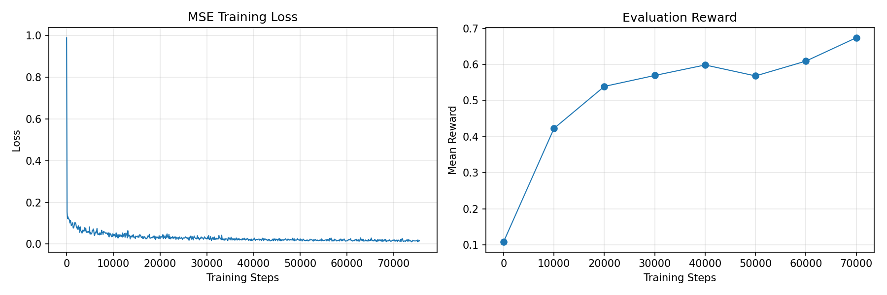
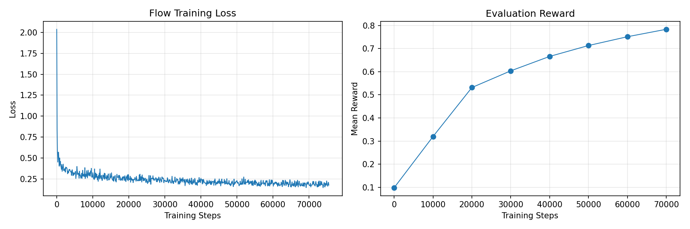

# Push-T Imitation Learning

A PyTorch implementation of action chunking imitation learning policies for the [Push-T](https://github.com/real-stanford/diffusion_policy) environment. Includes two policy types:

- **MSE Policy** — a simple MLP that predicts action chunks directly via mean-squared error
- **Flow Matching Policy** — a more expressive policy that learns a conditional vector field to transport noise into action chunks, similar to [Diffusion Policy](https://diffusion-policy.cs.columbia.edu/)

The observation is a 5-dimensional state describing the position of the T-block and the agent. The action is a 2-dimensional target position for the agent. The goal is to push the T-block into the goal zone.

---

## Setup

This project uses `uv` for package management — a fast, all-in-one replacement for `pip`, `pipx`, `conda`, and `virtualenv`.

### Install `uv`
```bash
curl -LsSf https://astral.sh/uv/install.sh | sh
```

After installation, open a new terminal so `uv` is on your `PATH`.

### Running scripts

Always use `uv run` rather than calling `python` or `pip` directly — it handles dependencies and the virtual environment automatically.
```bash
uv run src/hw1_imitation/train.py --help
```

To add a new dependency:
```bash
uv add <package>
```

This updates `pyproject.toml`, `uv.lock`, and installs the package into your environment.

---

## Experiment Tracking

This project uses [Weights & Biases](https://wandb.ai) for logging training metrics, evaluation videos, and model checkpoints. It is free for academic use.

Log in before running any training:
```bash
uv run wandb login
```

Follow the prompt to paste your API key.

---

## Training

Train the MSE policy:
```bash
uv run src/hw1_imitation/train.py --policy-type MSE
```

Train the flow matching policy:
```bash
uv run src/hw1_imitation/train.py --policy-type Flow
```

Key training options:

| Flag | Default | Description |
|------|---------|-------------|
| `--policy-type` | `mse` | Policy type (`MSE` or `flow`) |
| `--chunk-size` | `8` | Number of actions per chunk |
| `--hidden-dims` | `256,256,256` | MLP hidden layer sizes |
| `--num-epochs` | `400` | Number of training epochs |
| `--lr` | `3e-4` | Learning rate |
| `--eval-interval` | `10000` | Steps between evaluations |
| `--seed` | `42` | Random seed |

---
## Results
### MSE




### Flow Matching


